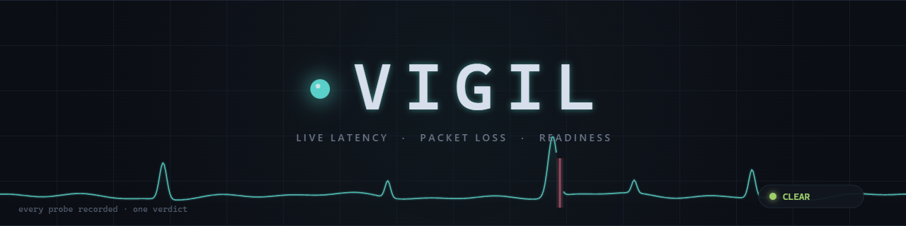
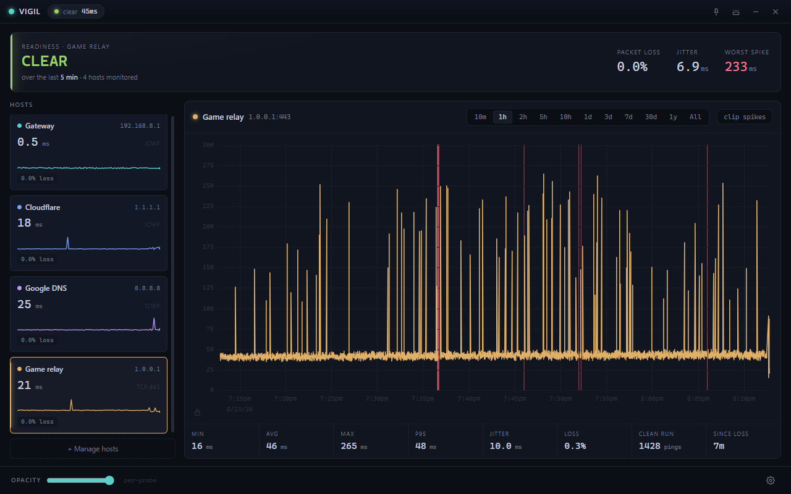
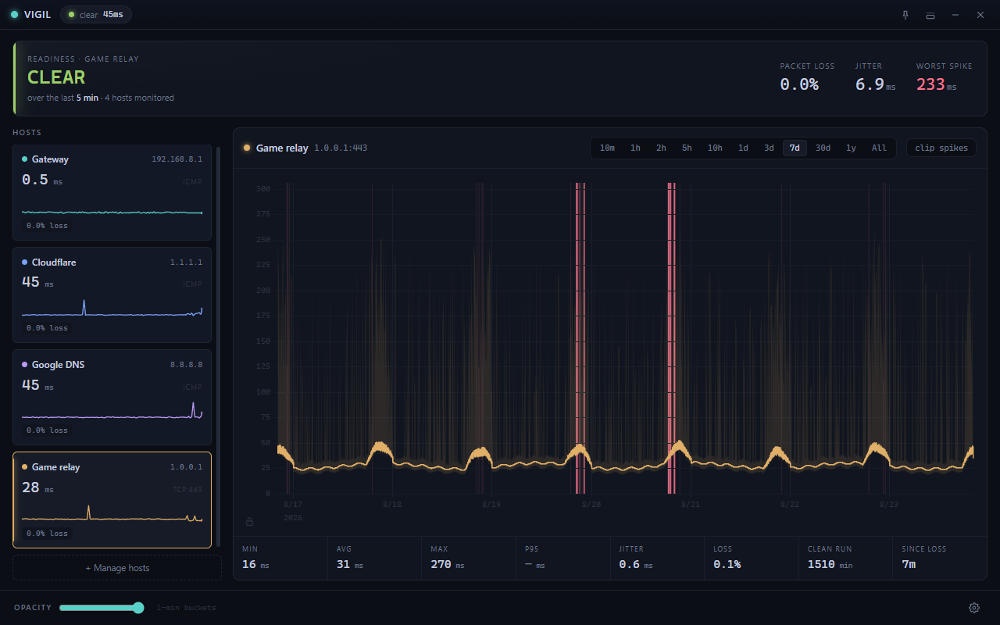
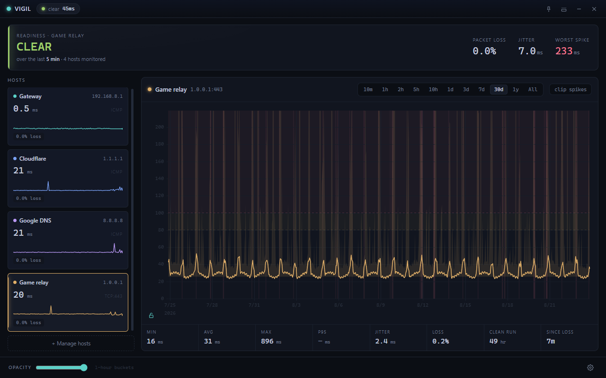
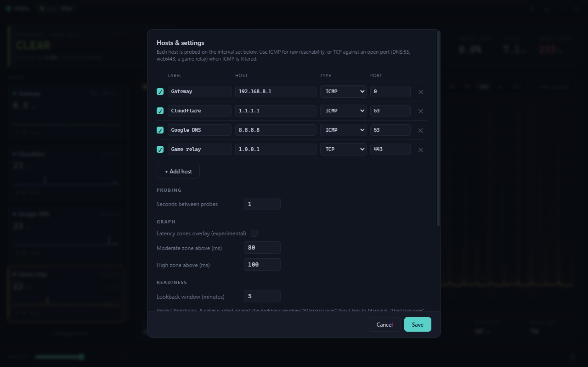
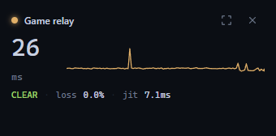

<p align="center"></p>

# Vigil

A live network latency and packet-loss monitor for Windows, macOS, and Linux. It answers one question fast: is my connection clean enough to queue right now. It also keeps a full history so you can scrub back across minutes, days, or months and see exactly when things went bad.

This is the `ping -t 8.8.8.8` habit turned into a real instrument. It watches several hosts at once, keeps min, average, and max for every slice of time, and gives you a plain readiness verdict — Clear, Marginal, or Unstable — based on the last few minutes.

<p align="center"></p>

<p align="center">
  
  
</p>
<p align="center">
  
  
</p>
<p align="center"><sub>Screenshots show generated demo data.</sub></p>

## Run it

You need Node.js 18 or newer.

```bash
npm install
npm start
```

That launches the app. No administrator or root privileges are required.

To build a distributable installer (optional), `npm run dist` uses electron-builder. You may want to add an icon and adjust the `build` block in `package.json` first.

## How the probing works

Vigil uses two probe types and you can mix them per host.

**ICMP.** For each ICMP host it launches one long-lived `ping` process and reads its output line by line. One process per host, alive for the whole session, so there is no per-probe process spawn cost. This is exactly your manual workflow, just parsed and recorded. ICMP is the most direct reachability signal but routers sometimes rate-limit or deprioritize it, so a clean ICMP result is necessary but not always sufficient.

**TCP.** For each TCP host it opens a real socket to a host and port and times how long the connection takes. This needs an open port on the host. Good choices are DNS on port 53, a web host on 443, or a game relay. A refusal still counts as reachable, because a refusal is a real round trip, so the time to refusal is a valid latency sample. A genuine timeout counts as loss. TCP is often the better signal for "can I play," because it measures a real connection rather than an ICMP echo that the network may treat differently.

The probe cadence defaults to one probe per second and is adjustable in settings ("Seconds between probes", 0.5–60). One note for Windows: the system `ping` has no interval flag in continuous mode, so at any interval other than 1s Vigil switches ICMP hosts to one single-shot ping per interval, which costs a small process spawn per probe but keeps the timing honest.

The four starting hosts are your gateway (auto-detected on first run), Cloudflare at 1.1.1.1, Google DNS at 8.8.8.8, and a disabled game-server slot. Point that last one at your server or relay IP and switch it on. For most game servers the traffic is UDP, so use ICMP against the server IP, or TCP against a known open port on the same host or its relay.

## Storage and the time windows

Every probe is folded into three tiers as it arrives, so spikes survive aggregation instead of being averaged away.

* Raw, one point per probe, kept about two hours at the default interval. This drives the 10m and 1h views.
* One-minute buckets with min, average, max, and loss, kept seven days. This drives the 2h through 7d views.
* One-hour buckets, kept about three years. This drives the 30d, 1y, and All views.

All three tiers are written to disk every 30 seconds and on quit, then reloaded on launch, so the 10m and 1h views (and the readiness verdict) are populated the moment the app starts, and your day, week, and month history survives restarts.

The snapshot is versioned (currently v2, position-encoded entries; v1 files from older builds load transparently) and written atomically — a temp file is renamed over the old one, so a crash mid-save can never leave a torn file. On every successful load the app also drops a `vigil-data.bak.json` last-known-good copy; a file it cannot read is preserved under a `.corrupt-` or `.incompatible-` name rather than overwritten.

Two files are written to Electron's per-user data folder: `vigil-data.json` for the history and `vigil-config.json` for your hosts and settings. The folder is `%APPDATA%\vigil\` on Windows, `~/Library/Application Support/vigil/` on macOS, and `~/.config/vigil/` on Linux. The name is `vigil` when run with `npm start` and becomes `Vigil` once packaged with electron-builder.

## The raw archive: every probe, forever

Independent of the capped snapshot, Vigil keeps a permanent archive of every single probe ("Archive every probe to daily files" in settings, on by default). It lives in `raw-archive/` next to the data file, one file per UTC day: today is plain JSONL that gets appended about once a minute, and each finished day is gzipped once and never touched again. Being append-only, the worst a crash can do is truncate the final line, which readers skip; recorded history is never rewritten.

The encoding squeezes out the domain redundancy before gzip ever sees it. Timestamps are implicit — a line carries a start time and the probe interval, and each sample occupies the next slot, with an explicit `@+2.5`-style resync marker whenever real arrival drifts more than two seconds, so decoded times are always within ~2s of reality. Stable stretches run-length-encode (`21x47` is forty-seven consecutive 21ms probes; `L` is a lost one), RTTs are rounded to 0.1ms, and the daily gzip pass compresses the remaining repetition across lines. A line looks like:

```
{"v":1,"id":"cf","t0":1756000000000,"iv":1000,"n":60,"s":"21x5 L 22 21x12 @+2.5 19x41"}
```

Measured against real recorded traffic, a day of four hosts probed every second lands around 300 KB gzipped — roughly 100 MB per year, about 1 GB per decade, 27x smaller than plain JSON. `tools/raw-archive.js` reads it back:

```bash
node tools/raw-archive.js stats                     # per-day summary
node tools/raw-archive.js verify                    # decode everything, report damage
node tools/raw-archive.js export --day 2026-08-23 --target cf --csv > cf.csv
```

## Launch at startup

Open settings and tick "Launch at startup." It registers a login item on Windows and macOS, and writes a `.desktop` entry to `~/.config/autostart/` on Linux. An auto-started instance opens straight to the tray rather than popping the window, so monitoring begins quietly at login and you click the tray icon when you want the full view. This takes effect for the installed build. In dev mode the login item points at the electron binary plus the project path, which works but is mainly useful once you package the app.

## The readiness verdict

The verdict looks only at the last few minutes of raw data, since that is what matters before you queue. It weighs three things: packet loss, jitter measured as the average change between successive pings, and how often latency spikes well above the local norm. A single stray spike will not flip it to Unstable. Sustained loss, high jitter, or frequent spikes will.

Lost packets are treated as a first-class problem. By default any lost probe inside the lookback window rates at least Marginal, and a run of three or more consecutive lost probes — a real blackout, however brief — rates Unstable outright, regardless of what the overall loss percentage works out to. A prober that goes silent (no reply lines at all, e.g. a dead route) is counted as loss too, not ignored.

All of the boundaries are adjustable in settings: the loss, jitter, and spike-rate thresholds for both Marginal and Unstable, the consecutive-loss rule, and the lookback window.

## Layout

The big readout up top is the verdict for the focused host. The left column lists your hosts with a live number, a sparkline, and current loss. Click one to focus it, or drag a row by the grip on its lower right to reorder the list. The main graph shows the focused host over the selected window as an average line inside a translucent min and max envelope, with packet loss drawn as red bands struck up from the baseline. Below it is a full stats strip.

Drag horizontally on the graph to zoom into a region; the view holds while new probes arrive, and double-clicking the chart (or the "zoomed" pill) returns to the live window. The "clip spikes" toggle next to the window tabs caps the Y axis at the 99th percentile of the visible data, so one 900ms outlier cannot flatten a sustained 150ms problem into the baseline — outliers stay in the data and draw clipped at the top edge.

The Y scale can also be taken manual, market-style: drag or scroll on the axis numbers to set the range (0 up to 1000ms), shown by the small lock icon in the lower-left corner of the chart turning open. A manual scale survives switching hosts and time windows, which makes readings comparable across timescales; click the lock to return to auto. And under Graph in settings there is an experimental latency-zones overlay (off by default): it tints the chart background above two customizable boundaries — moderate from 80ms, high from 100ms by default — so on a zoomed-out month view the many "small" 150ms spikes read as clearly in the high zone even when an 800ms outlier dominates the scale. The pin button keeps the window above other windows, including a borderless game, and it stays put when you click it. Compact mode shrinks it to a small always-on-top overlay you can leave in a corner while you play. Closing the window hides it to the tray and keeps monitoring. Quit from the tray menu to stop.

## Exporting a report for analysis

`tools/export-report.js` turns the stored history into a compact JSON report built for feeding to an AI or attaching to an ISP ticket:

```bash
node tools/export-report.js --pretty --out report.json
```

It auto-locates the data file, and the app can stay open since the file is rewritten every 30 seconds. The report contains per-target overall stats, daily summaries, two hour-of-day profiles in local time (a month-scale one from hour buckets and a fine one from the last week of minute buckets, including the rate of minutes containing a spike), the worst loss episodes with ISO timestamps, and a spike analysis against a median baseline. Useful flags: `--days N` to limit the span, `--target <id>` for one target, `--buckets` to include raw hour buckets, `--in <path>` to point at a specific data file. All timestamps in the report are UTC ISO strings, which correlate directly against modem event logs.

`tools/evidence-report.js` turns either that report or the raw data file into a single self-contained, print-friendly HTML evidence document intended for ISP escalation, with headline packet counts, a cross-target comparison, daily timeline and hour-of-day charts, and timestamped loss episode tables in local time:

```bash
node tools/evidence-report.js report.json --out evidence.html
node tools/evidence-report.js --in vigil-data.json --out evidence.html
```

Pointing it at `vigil-data.json` directly additionally renders fine last-hour and last-24-hour minute charts. Open the HTML in any browser and print to PDF for attaching to a ticket.

## Finding where the jitter enters: the path locator

Knowing that 8.8.8.8 is jittery tells you something is wrong; it does not tell you whether it is your wifi, your modem, your ISP, or the far end. `tools/path-jitter.js` is a standalone companion app for exactly that question. It traces the route to a target, then pings every responding hop continuously and in parallel — one persistent ping process per hop, the same probing model as the app — and compares loss and jitter per hop over a rolling window:

```bash
node tools/path-jitter.js                # trace + monitor 8.8.8.8
node tools/path-jitter.js 1.1.1.1        # any other target
node tools/path-jitter.js --window 10    # judge over the last 10 minutes
node tools/path-jitter.js --plain        # line output instead of the live table
```

It shows a live MTR-style table — per-hop loss, latency, jitter, and a sparkline — and a verdict that names the segment where the trouble starts, e.g. "problem enters between hop 1 and hop 3". Press `q` to quit, `r` to re-trace immediately. The route is re-traced every 15 minutes by default (`--retrace N`, 0 to disable), and path changes are counted and logged, since a flapping route is itself a jitter suspect.

One rule makes hop tables honest, and the verdict applies it for you: routers answer pings from their rate-limited control plane, so a noisy middle hop above a clean destination is cosmetic and gets labeled as ignorable. Only trouble that starts at some hop and persists through every later hop to the destination is treated as real. Hops that answer traceroute but ignore direct pings are kept for numbering but excluded from the analysis.

Leave it running while you play — intermittent faults only localize while they are actually happening. Each run writes a JSONL log (`vigil-path-<target>-<stamp>.jsonl`, disable with `--no-log`) with one timestamped per-hop snapshot per minute plus every trace and path change, in UTC ISO timestamps like the other reports, ready to feed to an AI or attach to an ISP ticket alongside the evidence report.

Like the app it needs no admin rights and no installs: it drives the system `ping`/`tracert` binaries, and where `traceroute` is missing (common on Linux) it discovers the path itself with TTL-limited pings. The same locale and macOS loss caveats from the notes below apply.

## Files

```
main.js            Electron main: window, tray, persistence, IPC, probe orchestration
preload.js         Safe IPC bridge to the renderer
src/probe.js       TCP and persistent-ICMP probers
src/store.js       Tiered ring-buffer store, rollups, and stats
src/config.js      Default hosts, windows, settings
src/datafmt.js     Snapshot format versions (v1/v2) and the shared normalizer
src/rawlog.js      Raw-archive line codec (run-length + implicit time)
src/archiver.js    Append-only daily raw archive with gzip rotation
src/sysinfo.js     Best-effort default-gateway detection
renderer/          UI: index.html, app.js, styles.css, vendored uPlot
```

## Notes and limits

On macOS the system `ping` does not report a line per lost packet, so ICMP loss there is approximate. TCP probing reports loss accurately on every platform. ICMP line parsing is built for English-language `ping` output. If you run a non-English Windows locale and ICMP loss looks off, switch the affected targets to TCP.
